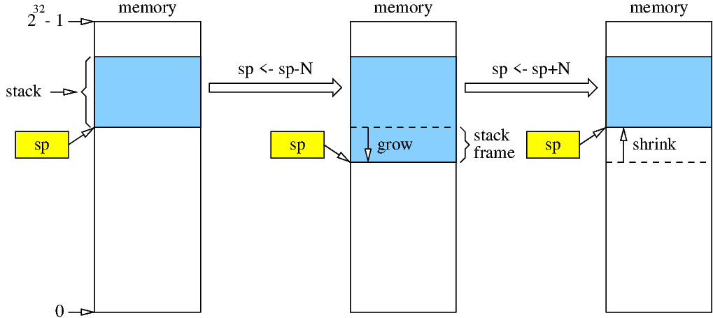

<!-- MASTER-ONLY: DO NOT MODIFY THIS FILE

Copyright © Telecom Paris
Copyright © Renaud Pacalet (renaud.pacalet@telecom-paris.fr)

This file must be used under the terms of the CeCILL. This source
file is licensed as described in the file COPYING, which you should
have received as part of this distribution. The terms are also
available at:
https://cecill.info/licences/Licence_CeCILL_V2.1-en.html
-->

Frequently asked questions

---

[TOC]

---

# GitLab authentication with `ssh` 

The following assumes that you use default names and locations for your `ssh` keys.
If you do not use the default you probably know what you are doing and do not need this FAQ.

## The `git` server asks for a password when I try to clone, push, pull, fetch, etc. how can I avoid this?

There are several possible reasons:

1. You tried to **clone** the repository using the `https` protocol (`https://gitlab.eurecom.fr/renaud.pacalet/ca.git`) and your OS does not provide a `git` credential manager to handle the password for you.
   Try again with the `ssh` protocol:

   ```bash
   $ git clone git@gitlab.eurecom.fr:renaud.pacalet/ca.git
   ```

1. You already successfully cloned the repository but you did it using the `https` protocol (`https://gitlab.eurecom.fr/renaud.pacalet/ca.git`) and your OS does not provide a `git` credential manager to handle the password for you.
   Check the protocol:

   ```bash
   $ cd path/to/the/clone
   $ git remote -v
   origin   https://gitlab.eurecom.fr/renaud.pacalet/ca.git (fetch)
   origin   https://gitlab.eurecom.fr/renaud.pacalet/ca.git (push)
   ```

   If it is `https`, either set up a `git` credential manager or change the protocol for `ssh`:

   ```bash
   $ git remote set-url origin git@gitlab.eurecom.fr:renaud.pacalet/ca.git
   $ git remote -v
   origin   git@gitlab.eurecom.fr:renaud.pacalet/ca.git (fetch)
   origin   git@gitlab.eurecom.fr:renaud.pacalet/ca.git (push)
   ```

1. You used the `ssh` protocol but you did not add your `ssh` public key to your GitLab account.
   If you do not have a `ssh` key pair yet (see [How do I know if I already have a `ssh` key pair?](#how-do-i-know-if-i-already-have-a-ssh-key-pair)) generate one (see [How to generate a ssh key pair?](#how-to-generate-a-ssh-key-pair)).
   Add the public part of your key pair to your GitLab account (see [How do I add my `ssh` public key to my GitLab account?](#how-do-i-add-my-ssh-public-key-to-my-gitlab-account)).

1. You do not have a `ssh` agent running or your shell does not know about it.
   Check:

   ```bash
   $ ssh-add -l
   Could not open a connection to your authentication agent.
   ```

   If you do not have a running `ssh` agent, launch one:

   ```bash
   $ eval $(ssh-agent -s)
   ```

1. You have a running `ssh` agent but you did not add your private key to the agent.
   Do it:

   ```bash
   $ ssh-add
   ```

  > Note: if your private key is protected you will have to enter your passphrase to unlock it.

## How do I know if I already have a `ssh` key pair?

Your `ssh` key pairs are normally stored in a sub-directory of your home directory named `.ssh`.
Each key pair is stored in two files: `KEY.pub` for the public part and `KEY` for the private part, where `KEY` is some name.
To check what `ssh` keys you have simply list the content of this sub-directory:

```bash
$ ls ~/.ssh
authorized_keys  id_ed25519      id_rsa      known_hosts
config           id_ed25519.pub  id_rsa.pub
```

In this list we see 2 key pairs: `id_ed25519`/`id_ed25519.pub` and `id_rsa`/`id_rsa.pub`.

## How to generate a `ssh` key pair?

`ssh-keygen` is the command that generates `ssh` key pairs.
During the key pair generation you will be asked to enter the name of the file in which to save the key; hit <kbd>Enter</kbd> to accept the default.
You will also be asked to type twice a passphrase to protect the private key.
If you enter en empty passphrase (by just hitting the <kbd>Enter</kbd> key) your private key will not be passphrase-protected.
As it is stored under your home directory with restricted access permissions, and as what you will do with your GitLab account is probably not critical, this is a reasonable choice that will save yourself the burden of remembering a passphrase and having to type it from time to time.
But if you are concerned about security, or intend to store valuable assets on your GitLab account, feel free to enter a non-empty passphrase.
Example of key pair generation under GNU/Linux (`ed25519` is the kind of key pair currently recommended by security experts over the default `rsa`):

```bash
$ ssh-keygen -t ed25519
Generating public/private ed25519 key pair.
Enter file in which to save the key (/homes/shelley/.ssh/id_ed25519):
Enter passphrase (empty for no passphrase):
Enter same passphrase again:
Your identification has been saved in /homes/shelley/.ssh/id_ed25519
Your public key has been saved in /homes/shelley/.ssh/id_ed25519.pub
The key fingerprint is:
SHA256:OlWKH9VRKKM3TJYfSgkO9VzZRyegHlrFbs913FTigFo shelley@megantic
The key's randomart image is:
+--[ED25519 256]--+
|      ..o. =**+.=|
|       o oE==+.o+|
|        .OO*...+.|
|       .oB=.+   =|
|      . S..o o ..|
|       + .    o  |
|      o .        |
|       .         |
|                 |
+----[SHA256]-----+
```

Your public key is in `~/.ssh/id_ed25519.pub` and your private key is in `~/.ssh/id_ed25519`.
Of course, as the names indicate, you can (and must) disclose the former but you must keep the latter secret.
This is why `ssh` complains if your private key files have too open access permissions.

## How do I add my `ssh` public key to my GitLab account?

Visit the [_SSH Keys_ section of your _User Settings_](https://gitlab.eurecom.fr/-/profile/keys), log in with your LDAP-EURECOM credentials if asked to.
Copy the **content** of `~/.ssh/KEY.pub` (where `KEY` is the base name of the key you want to use) to the clipboard, paste it in the `Key` text box and click on the `Add Key` button.

# Working on personal computer

## Can I clone the git repository on my laptop?

Yes, likely.
How to do it depends on your OS, git client, preferred authentication method…

Under Windows I recommend installing [Git for Windows] and using the bash emulator that comes with it (even if there is also a graphical user interface).

Under macOS I recommend installing decently recent GNU/Linux utilities (bash, git…) with, e.g., [MacPorts] or [Homebrew].
The versions of these that come with macOS are frequently outdated.

Under any GNU/Linux OS, bash, the ssh client and the git client should be available by default.

Then, open a bash terminal and type the following commands.

```bash
$ git clone git@gitlab.eurecom.fr:renaud.pacalet/ca.git ~/Documents/ca
$ cd ~/Documents/ca
$ git checkout shelley
$ git pull --no-edit
$ git merge --no-edit origin/master
$ git config user.name shelley
$ git config user.email mary.shelley@eurecom.fr
```

## Can I install RARS on my laptop?

Yes, it should be easy, see the [RARS Github project].
It should work on any java-capable computer (Window, macOS, GNU/Linux).

## Can I install the RISC-V toolchain on my laptop?

It should be possible but be careful: it is huge (almost 7 GB), takes time to download, and is not easy to configure and build.
As it does not need a graphical user interface, an easy alternative is to use the toolchain installed on EURECOM GNU/Linux desktop computers through ssh and to download the compilation results with scp.

If you insist see the [Github project of the RISC-V toolchain].

# The shell

## What are shell variables and how to use them?

Like most programming languages the shell supports variables to store values.
A variable name contains only letters, digits and underscores and must start with a letter or a underscore.
It is defined by a simple assignment with no spaces around the `=` sign:

```bash
$ foo=42
```

It is expanded by preceding its name with a `$` sign:

```bash
$ echo foo
foo
$ echo $foo
42
```

Undefined variables expand as the empty string:

```bash
$ echo X${bar}X
XX
```

If a variable expansion is immediately followed by alphanumeric characters or underscores it must be isolated with curly braces to avoid ambiguities:

```bash
$ echo $foobar

$ echo ${foo}bar
42bar
```

> Note: variable definitions are not persistent, they are valid only for the current shell.
> To avoid having to type them each time you open a new terminal window or a new tab in a terminal window see [How to make my shell variable definitions permanent?](#how-to-make-my-shell-variable-definitions-permanent).

## What is the difference between environment variables and regular variables?

By default a variable definition is valid only for the current shell, not for sub-shells or commands launched from the current shell.
The `export` built-in command of the shell is used to pass variable definitions to subsequently executed commands:

```bash
$ foo=42
$ export foo
```

Or, all at once:

```bash
$ export foo=42
```

When a sub-shell or a command is launched it inherits all exported variables of the parent shell.
They are part of its _environment_, reason why they are called _environment variables_.

## How can I use shell variables to simplify the typing of long commands?

Some commands can be quite long, especially when they involve absolute paths.
Example: assume we want to convert several files from this project to upper case using the `/packages/LabSoC/bin/to_uc` toy utility.
Suppose also we were asked to work out of the source tree to avoid accidental addition of generated files to the git repository.
We could type:

```bash
$ mkdir -p /tmp/shelley/labs   # create a temporary working directory under /tmp
$ cd /tmp/shelley/labs         # change current directory
$ /packages/LabSoC/bin/to_uc /homes/shelley/Documents/ca/FAQ.md FAQ.MD
$ /packages/LabSoC/bin/to_uc /homes/shelley/Documents/ca/README.md README.MD
$ /packages/LabSoC/bin/to_uc /homes/shelley/Documents/ca/foo/bar/baz BAZ
...
```

We could also use _shell variables_ to simplify the typing.
Once a variable was defined it can be used in commands:

```bash
$ cln=/homes/shelley/Documents/ca  # absolute path of clone of git repository
$ twd=/tmp/shelley/labs            # absolute path of temporary working directory
$ mkdir -p $twd                    # create temporary working directory
$ cd $twd                          # change current directory
$ /packages/LabSoC/bin/to_uc $cln/FAQ.md FAQ.MD
$ /packages/LabSoC/bin/to_uc $cln/README.md README.MD
$ /packages/LabSoC/bin/to_uc $cln/foo/bar/baz BAZ
...
```

We can do even better with the [`PATH` environment variable](#what-is-the-path-environment-variable-and-how-to-use-it).

## What is the `PATH` environment variable and how to use it?

Some commands you type in the terminal are built-in commands of the shell; the shell knows them because they are part of it.
To run these commands you just use their name:

```bash
$ echo "Hello world!"
Hello world!
```

In order to run an external command, that is, not a built-in, like the `to_uc` toy command, you can type its absolute path:

```bash
$ /packages/LabSoC/bin/to_uc /homes/shelley/Documents/ca/FAQ.md FAQ.MD
```

As this is not very convenient, the shell uses an environment variable named `PATH` which value is a colon-separated list of directories in which external commands are searched for.
Let's print its current value:

```bash
$ printenv PATH
/bin:/usr/bin:/usr/local/bin
```

As it is not part of it yet let's add `/packages/LabSoC/bin` to the `PATH` definition:

```bash
$ export PATH=$PATH:/packages/LabSoC/bin
$ printenv PATH
/bin:/usr/bin:/usr/local/bin:/packages/LabSoC/bin
```

> Note how we use the current value of the variable (`$PATH`) in the new value.
> Be careful when typing the variable assignment because if you get it wrong it could be that your shell does not find any command any more.
> If it happens, just launch a new shell.

The letter case conversion command can now be as simple as:

```bash
$ to_uc /homes/shelley/Documents/ca/FAQ.md FAQ.md
```

> Note: this `PATH` definition is not persistent, it is valid only for the current shell.
> To avoid having to type it each time you open a new terminal window or a new tab in a terminal window see [How to make my shell variable definitions permanent?](#how-to-make-my-shell-variable-definitions-permanent).
> To simplify also the typing of the source file path see [How can I use shell variables to simplify the typing of long commands?](#how-can-i-use-shell-variables-to-simplify-the-typing-of-long-commands).

## How to make my shell variable definitions permanent?

When a new shell is launched (for instance when you open a new terminal window or a new tab in a terminal window) it sources a _runcom_ (`rc`) file.
Which file is sourced depends on which shell it is (`bash`, `zsh`…), if it is interactive or not, and if it is a login shell or not.
If you are working on a EURECOM GNU/Linux computer your default shell is probably `bash` and if you launched a new shell by opening a new terminal window or a new tab in an existing terminal window, chances are that the sourced _runcom_ file was `~/.bashrc+`.

So, you can make variable definitions permanent by adding them to this file.

> Note that this will take effect only the next time you will launch a new shell.

This is not limited to variable definitions.
Definitions of aliases, shell functions… can also be added to the _runcom_ file.
Other commands too.

## When trying to execute a command I get a `command not found` error, why?

One first possible reason is that the command is not installed on the computer.
If you know where the command is supposed to be you can verify if it is installed by listing the content of the directory where it is supposed to be:

```bash
$ ls /packages/LabSoC/bin
```

Note: do not rely on your shell's auto-completion (e.g., `ls /packages/LabS<tab>`) to conclude that a directory is not there; they are auto-mounted and the completion can fail just because the auto-mounter did not mount the NFS share yet.

Another possible reason is that you forgot to tell your shell where to find the command.
See the [`PATH` environment variable](#what-is-the-path-environment-variable-and-how-to-use-it).

## How can I avoid having to source the `/packages/LabSoC/bin/labs-functions` script every time I open a new terminal?

When you source the `/packages/LabSoC/bin/labs-functions` script the `rars` and `c2rv` definitions will work only in the current tab of the current terminal.
If you open a new terminal or tab you will need to source again the `/packages/LabSoC/bin/labs-functions` script.
On EURECOM's GNU/Linux computers you can make the definitions permanent by adding the following lines at the end of the `~/.bashrc+` file:

```bash
rars() { /usr/java/bin/java -jar /packages/LabSoC/bin/rars.jar & }
c2rv() { /packages/LabSoC/riscv/bin/riscv32-unknown-linux-gnu-gcc -march=rv32im -mabi=ilp32 -S "$@"; }
```

> Note that, depending on your configuration you may have to launch a new terminal or even to log out and log in before it takes effect.

On other computers there is likely a way to achieve the same.
If you are using `bash` as your command line interface simply add the following lines at the end of the `~/.bashrc` file (no trailing `+` sign in the file name):

```bash
rars() { java -jar PATH-TO-RARS-JAR & }
c2rv() { PATH-TO-RISCV32-UNKNOWN-LINUX-GNU-GCC -march=rv32im -mabi=ilp32 -S "$@"; }
```

Where `PATH-TO-RARS-JAR` is the path to the RARS jar archive you installed and `PATH-TO-RISCV32-UNKNOWN-LINUX-GNU-GCC` is the path to the RISC-V `gcc` cross-compiler you installed.

If you are using a different command line interface read its documentation.

# The RV32IM ISA and its ILP32 ABI

## How to write functions and call them in assembly code?

In assembly language, just like in most programming languages, structuring the source code is essential.
Functions are the basis of code structuring; they provide modularity, encapsulation of implementation details and code reuse.
A function optionally takes input parameters, returns output results, uses local variables, calls other functions.
At the end of the execution of a function the caller program resumes with the instruction that follows the function call.
All these aspects are apparently simple in high level programming languages.
Example of a factorial function in the C language:

```c
// compute and return n! = 1*2*3*...*n
unsigned factorial(unsigned n) {
  unsigned result;

  if(n < 3) result = n;
  else result = factorial(n - 1) * n;
  return result;
}
```

Example of call of the factorial function from another function:

```c
...
var = factorial(5);
...
```

In assembly language things are more complicated because all the low level details that are normally handled automatically by the compiler must be handled manually.
We must decide how the input parameters and output results are passed between the calling program (the _caller_) and the called function (the _callee_), where the local variables of the function are stored, how to return to the caller at the end of the function and how other functions can be called from the function itself.
Of course, all this must be consistent between the caller and the callee: if the caller passes an input parameter in register `x2` but the callee expects it to be passed in register `x3`, things will not work as expected.
As caller and callee functions can be written by different programmers, or compiled from different source files, we need a global convention; this is what the "Application Binary Interface" (ABI) provides.
See [What is the ILP32 ABI for the RV32IM ISA?](#what-is-the-ilp32-abi-for-the-rv32im-isa) to learn more about the "Integer, Long and Pointers 32 bits" (ILP32) ABI for the RV32IM "Instruction Set Architecture" (ISA).

## What is the ILP32 ABI for the RV32IM ISA?

The "Integer, Long and Pointers 32 bits" (ILP32) ABI for the RV32IM "Instruction Set Architecture" (ISA) is named so because it targets 32 bits architectures.
It contains, among other things, conventions about the use of the general purpose registers, the memory and function calls.

The RV32IM general purpose registers are named `x0` to `x31`.
The ILP32 ABI gives them a second meaningful name corresponding to their given role in the ABI conventions:

| Register  | Name     | Description                          | Saved  |
| :---      | :---     | :---                                 | :---   |
| `x0`      | `zero`   | Constant 0                           | N/A    |
| `x1`      | `ra`     | Return address                       | No     |
| `x2`      | `sp`     | Stack pointer                        | Yes    |
| `x3`      | `gp`     | Global pointer (don't touch)         | N/A    |
| `x4`      | `tp`     | Thread pointer (don't touch)         | N/A    |
| `x5-x7`   | `t0-t2`  | Temporary registers                  | No     |
| `x8`      | `s0/fp`  | Saved register or frame pointer      | Yes    |
| `x9`      | `s1`     | Saved register                       | Yes    |
| `x10-x11` | `a0-a1`  | Function arguments and return values | No     |
| `x12-x17` | `a2-a7`  | Function arguments                   | No     |
| `x18-x27` | `s2-s11` | Saved registers                      | Yes    |
| `x28-x31` | `t3-t6`  | Temporary registers                  | No     |

In your assembly coding prefer the meaningful names.
Ignore and don't use the `gp` (`x3`) and `tp` (`x4`) registers; we don't have time to discuss their role in this course.
The conventions about these registers and function calls are the following:

- The input parameters of functions are passed in registers `a0` to `a7`; if the function has only one 32 bits input parameter it is passed in `a0`, if it has two 32 bits input parameters they are passed in `a0` and `a1`, etc.
- The output results of functions are passed in registers `a0` and `a1`.
- Register `ra` is used to store the return address of functions:
  * Before jumping at the first instruction of the callee the caller must store the `pc+4` return address in register `ra` (where `pc` is the address of the jump instruction itself).
    In order to do this the caller can call the callee with the `jalr ra,...` or `jal ra,...` basic instructions, or the equivalent `call label` pseudo instruction.
  * At the end the callee shall jump back at the address it received in register `ra`.
    This can be achieved with, for instance, the `jalr zero,ra,0` basic instruction, or the equivalent `ret` pseudo instruction.
- Registers `sp`, `gp`, `tp` and `s0-s11` are the _saved_ registers: their content must absolutely be preserved by the callee because they can be in use by the caller at the time of the function call.
  If the callee needs to use these registers it **must** save them _somewhere_ before modifying their content, and it **must** restore the original content before returning to the caller.
- Registers `ra`, `t0-t6` and `a0-a7` are the _non-saved_ registers: they may be freely modified by the callee because the caller does not expect their content to be preserved across function calls.
  If the caller has valuable data stored in these registers it **must** save them _somewhere_ before calling any function.

These conventions are not sufficient to solve all potential issues.
Where is the _somewhere_ where the caller or the callee are supposed to save the content of registers when they need to do so?
If the callee uses a lot of local variables, more than the number of non-saved registers, where will it store them?
If the callee must itself call another function, it must pass it the return address in register `ra`, overriding its own return address; where shall it save its own return address?
For the answers to all these questions see [What are the stack, the stack frames and the stack pointer?](#what-are-the-stack-the-stack-frames-and-the-stack-pointer).

## What are the stack, the stack frames and the stack pointer?

The stack is a region of the memory where functions can store information when they cannot do it with the available registers.
As shown in the figure below the stack grows towards low addresses, shrinks towards high addresses and its lowest address is always in the `sp` register.



When a function needs some storage space, say `N` bytes, it allocates a _stack frame_ on the stack by subtracting `N` from register `sp`.
Once this is done it can store data in this stack frame up to the allocated `N` bytes.
A recommended practice is to do this at the very beginning of the function, before any other action, and then to save the `ra` register in the stack frame, plus all saved registers that the function will modify.
Saving `ra` is recommended even if, in the current version, the function does not modify it, because the code could be updated at a later stage and function calls could be added.
The new value of `sp` is used as base address for all these store operations.
During execution the function can also use its stack frame to store extra data, like local variables.
At the end of its execution, before returning, the function restores `ra` from the stack frame, plus all saved registers that have been modified.
Then, it deallocates the stack frame and restores register `sp` by adding `N` to `sp`.

Note that, among all saved registers `sp` is the only one that is not preserved by storing it in the stack frame.
It is preserved by adding to it the same `N` value that was subtracted at the beginning.

Example of RV32IM assembly code for the `factorial` C function shown in [How to write functions and call them in assembly code?](#how-to-write-functions-and-call-them-in-assembly-code):

```riscv
# compute and return n! = 1*2*3*...*n
# n passed in a0, result returned in a0
factorial:
  addi sp,sp,-8      # allocate 8 bytes stack frame (2 words)
  sw   ra,0(sp)      # save ra in stack frame
  sw   s0,4(sp)      # save s0 in stack frame
  addi s0,zero,3     # s0 <- 3
  bltu a0,s0,end     # go to end if a0 (n) unsigned-less than s0 (3)
  add  s0,zero,a0    # save a0 (n) in s0
  addi a0,a0,-1      # a0 <- a0-1
  jal  ra,factorial  # call factorial, a0 <- factorial(n-1)
  mul  a0,a0,s0      # a0 <- a0*s0 = factorial(n-1)*n
end:
  lw   s0,4(sp)      # restore s0 from stack frame
  lw   ra,0(sp)      # restore ra from stack frame
  addi sp,sp,8       # deallocate stack frame, restore sp
  jalr zero,ra,0     # return to caller, the result is in a0
```

[Git for Windows]: https://gitforwindows.org/
[MacPorts]: https://www.macports.org/
[Homebrew]: https://brew.sh/
[RARS Github project]: https://github.com/TheThirdOne/rars
[Github project of the RISC-V toolchain]: https://github.com/riscv-collab/riscv-gnu-toolchain

<!-- vim: set tabstop=4 softtabstop=4 shiftwidth=4 expandtab textwidth=0: -->
