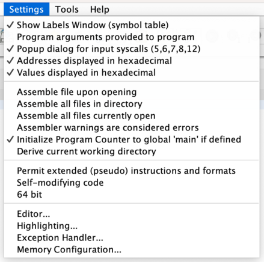

<!-- MASTER-ONLY: DO NOT MODIFY THIS FILE

Copyright © Telecom Paris
Copyright © Renaud Pacalet (renaud.pacalet@telecom-paris.fr)

This file must be used under the terms of the CeCILL. This source
file is licensed as described in the file COPYING, which you should
have received as part of this distribution. The terms are also
available at:
https://cecill.info/licences/Licence_CeCILL_V2.1-en.html
-->

Quick start with RARS, the RISC-V Assembler and Runtime Simulator

---

[TOC]

---

As for any lab do not forget to write a report in [Markdown syntax] in the `REPORT.md` file.
Remember that the written reports and source code are personal work (plagiarism is not accepted).
Do all assignments yourself and try to understand each of them.
You can of course discuss with others, exchange ideas, ask others for help, help others...
It is even warmly recommended, but at the end your report and source code must be your personal work.
They are due the day **before** the written exam at 23:59.
After this deadline the git repository will become read-only and there will be no possibility any more to add or modify something.

The following assumes a student named Mary Shelley.

## Set-up

1. Open a terminal, change the working directory to the `ca` clone, check the current status:

    ```bash
    $ cd ~/Documents/ca
    $ git status
    On branch shelley
    Your branch is up to date with 'origin/shelley'.
    
    nothing to commit, working tree clean
    ```

1. If the current branch is not your personal branch, switch to your personal branch and check again the current status:

    ```bash
    $ git checkout shelley
    $ git status
    ...
    ```

1. If your branch is not up to date with `origin/shelley` or there is something to commit or the working tree is not clean, add, commit and/or pull until everything is in order.

1. Pull, merge with `origin/master`, change the working directory to this lab's directory and list the directory's content:

    ```bash
    $ git pull --no-edit
    $ git merge --no-edit origin/master
    $ cd labs/1-rars
    $ ls
    README.md
    REPORT.md
    binary.s
    ```

   `README.md` is the file you are currently looking at, `REPORT.md` is the empty file in which you will write your lab report and the `binary.s` file is an empty file in which you will write RV32IM assembly code.

1. Source the `/packages/LabSoC/bin/labs-functions` script to define several helper shell functions:

    ```bash
    $ source /packages/LabSoC/bin/labs-functions
    ```

   Remember that these definitions are for the current terminal only.
   If you open a new terminal, source the script again.

## Introduction

In this lab we will have a quick tour of RARS, the RISC-V Assembler and Runtime Simulator.
We will also do some assembly coding to experiment with the low-level representation of numbers.

There are usually 3 ways to launch an action with RARS:
- Select an entry in a menu.
- Click on an icon.
- Use a keyboard shortcut (shortcuts are indicated near the menu entry with the same effect).

In the following directions we use the menu entries method with the `[M -> E]` syntax to designate the `E` entry of the `M` menu; feel free to use the method you prefer.

Unless otherwise stated add all new instructions at the end of `binary.s`, after the existing ones.
At the end of the lab you should have a source code that is the concatenation of all your answers to the questions.
Unless otherwise stated use only the temporary registers for your experiments (`t0` to `t6`).

## Launch RARS, settings, help, registers

Launch RARS (just type `rars` in your terminal), open the `Settings` menu and configure it according the following picture:



The right panel of the main window displays the current state of the internal registers of our emulated CPU.
The `Registers` panel shows the 32 general purpose registers and the program counter (`pc`).
Each of these registers has 2 names: a meaningful one (e.g., `zero` for the constant zero register, `t5` for temporary register number 5) and a generic one (e.g., `x0` for `zero` or `x30` for `t5`).
When writing assembly code you can use one or the other name, as you wish.
Ignore the two other tabs of the `Registers` panel, we don't need them for now.
All registers are 32 bits wide because we configured RARS to emulate a 32 bits processor.

1. What is the current content of the `pc` register?

1. Some other registers are initialized to non-zero values.
   In your terminal use the `s2i` bash function to convert the hexadecimal representation of their content to integer values (type `s2i 0x...`).

1. Do you understand why all values are positive even when the register content is considered as an integer in sign and magnitude or 2's complement?

Open the help window (`[Help -> Help]`) and select its `RISCV` tab.
In the `RISCV` tab select the `Basic instructions` sub-tab.
It lists the RV32IM basic instructions that we will use.

Ignore the other sub-tabs, we don't need them for now.

## Unsigned and signed integers

The CPU general purpose registers (`x0` to `x31`) are not typed like variables can be in some programming languages.
Their content is just a string of 32 bits.
How to interpret this string is our decision; it could be a number, an address, the encoding of a subset of a superset with 32 elements, the [ASCII codes] of 4 characters, or anything else.
It could be that only some bits are relevant and we ignore the others.
So, before processing data and selecting the instructions to use, it is essential to have a clear understanding of the representation of data.

In the following coding exercises we will consider the content of the registers as 32 bits numbers and we will observe the effects of some RISCV instructions on these values.

### Notations

- In the following we denote `u(r)`, `sm(r)`, `tc(r)` the value corresponding to the content of register `r` considered as an unsigned number, as a signed number in sign and magnitude representation, and as a signed number in 2's complement representation, respectively.
- By default literal integer values are represented in decimal (base 10).
- Values represented in hexadecimal (base 16) are prefixed with `0x`.

### Coding

1. In the help window search the basic instructions that could be used to initialize register `t0` such that `u(t0)` = 1.

1. In the main window open the `binary.s` empty file (`[File -> Open]`).
   Insert a label named `init` (simply type `init:` on the first line).
   Labels are shorthands for addresses; if you use `init` in your code the assembler will replace it with the address of the instruction that follows the label declaration.
   On the second and following lines type the instructions you found and save the file (`[File -> Save]`).

### Assembling

1. Assemble the code (`[Run -> Assemble]`).
   If there are errors fix them and assemble again until the operation completes successfully.
   The `Execute` tab of the left panel now shows you a detailed view of the portion of the memory that contains the instructions (the _code segment_).
   Each line corresponds to one basic RV32IM instruction:
   - The left column (`Bkpt`) is for breakpoints (back on this later).
   - The `Address` column shows the address in memory of the instruction.
   - The `Code` column shows the instruction encoding in hexadecimal.
   - The `Basic` column shows the human-readable form of the instruction in RV32IM assembly language.
   - The `Source` column shows the source code you wrote with line numbers on the left.

1. What is the address of the first instruction?

1. Do you understand why the current content of the `pc` register is the same?

In the following, when asked to modify your code and execute it, do not forget to save and assemble again before executing.

### Simulation

It's time to test your code step-by-step.

1. Execute only the first instruction (`[Run -> Step]`) and observe the changes in the registers.
   What registers changed?
   Are these changes consistent with what you imagined?

1. If you have more instructions continue executing step by step but before executing each instruction try to predict what the effect will be on the registers and check that you predictions were correct after it has been executed.

### Left shifts as a way to multiply by powers of 2

1. Add label `shift1` and instructions to shift `t0` by one position to the left and store the result in register `t1`.

1. Assemble (`[Run -> Assemble]`) and execute your code (`[Run -> Go]`).
   If considered as an unsigned number what is the final value stored in `t1` (use again the `s2i` function if you are not sure)?

1. Imagine a way to multiply by 3 an unsigned number stored in `t2` without using the `mul` instruction.
   Add label `mul3` and the corresponding instructions.

1. Assemble but before executing, in the right panel, double-click on the value of `t2` and modify it such that `u(t2)` = 42.
   Execute your code and check that `u(t2)` = 126.

1. To avoid the manual initialization of `t2` each time we execute, just before label `mul3`, insert label `i42` and instructions to initialize `t2` such that `u(t2)` = 42.
   Execute and check that the final value in `t2` is correct.

### Overflows

As the registers are 32 bits wide they can represent only a subset of the integer numbers of maths.
Let us observe what happens when we try to exceed this range.

Note: you can execute backward step-by-step with `[Run -> Backstep]`.

1. Add label `s23` and instructions to shift register `t2` by 23 positions to the left.
   Assemble, execute.
   Use `s2i` and note the decimal unsigned number corresponding to the current content of `t2`.
   Use a calculator to verify that `u(t2)` =  $`126 \times 2^{23}`$.
   This is what left shifts do to numbers: each shift multiplies by 2, shifting by 23 positions is the same as multiplying by $`2^{23}`$.
   Right shifts do the opposite: divide by a power of 2.

1. Add label `t2pt2` and instructions to add `t2` to itself and store the result again in `t2`.
   Assemble, execute and note `u(t2)`.
   This is another way to multiply a register by 2 without using the `mul` instruction: add it to itself.

1. Copy several times the instructions you added after label `t2pt2` such that `t2` can be added to itself several times.
   Assemble, put a breakpoint on the first instruction after `t2pt2`, and execute until the breakpoint.
   Continue the execution step-by-step and observe the evolution of `u(t2)`, `sm(t2)` and `tc(t2)`.
   After how many additions `sm(t2)` and `tc(t2)` become negative?
   This is a first kind of overflow situation: the addition of two positive numbers gives a negative one.

1. Use `s2i` and note `u(t2)` before and after this sign change.
   Use a calculator to check that the second value, if considered as unsigned, is correct.
   Because it is, we could recover the value before the sign change by shifting `t2` to the right with the `srli` (shift-right-logical) instruction, which is the same as dividing by 2.

1. Add `t2` to itself one more time after the sign change.
   Is the new `u(t2)` still correct?
   With this last addition we lost information and we could not recover it.
   This is a second kind of overflow situation: even if considered as unsigned the result of the addition of large unsigned numbers is wrong because it does not fit in 32 bits.

### Sign and magnitude or 2's complement

1. Imagine a way to discover if, in the RV32IM Instruction Set Architecture, signed numbers are represented in sign and magnitude or in 2's complement.
   Add label `tc` and the corresponding instructions, assemble, execute.
   What do you conclude?
   Why?

Note: near the bottom of the `Execute` tab of the left panel, a radio button (`Hexadecimal Values`) selects how the content of the registers is displayed.
This is another way to convert their content to numbers but only to hexadecimal or decimal, and only by considering the content as an integer number in 2's complement representation.
For other formats or representations continue using the `s2i` function.

Note: when coding immediate operands in your code you can also use the decimal format (the default) or the hexadecimal (`0x...`) format.

### Modulo a power of 2

1. Imagine a way to compute the modulo 128 of an unsigned number stored in `t3` without the multiplication, division or remainder instructions, and store it in register `t4`.
   Add label `mod128`, instructions to initialize `t3` with 1547, and your instructions.
   Assemble, execute and check that `u(t4)` = 11.

1. Would it work with negative numbers?
   Why?

1. How would you compute the modulo $`2^n`$ with $`1 \le n \le 31`$?

### Underflow

1. What is the smallest negative number that can be represented on 32 bits?
   Add label `min` and instructions to store this value in `t2`, assemble, execute and check that `t2` indeed contains the smallest negative number.

1. Add label `m1` and instructions to subtract 1 from `t2` (add -1).
   Assemble and execute.
   What is the new `tc(t2)`?
   This is another kind of overflow situation: the result of the addition of 2 negative numbers is positive because it does not fit on 32 bits.

### Right shifts as a way to divide by powers of 2

1. Add label `rs` and instructions to store again the smallest negative number in `t2`, and shift it to the right by one position with the `srli` instruction to divide it by 2.
   Assemble and execute.
   What is the new `tc(t2)`?
   Is it half the smallest negative number?
   This is another situation were the numeric result is not the expected one while the computation could be exact (the original number is even) and its result could fit on 32 bits.

1. Repeat the instructions you added in the previous question but replace `srli` with `srai`.
   Assemble and execute.
   What is the new `tc(t2)`?
   Is it half the smallest negative number?

`srli` means Shift-Right-Logical by Immediate shift amount.
The bits entering on the left are zeros.
If we shift a negative number the result thus becomes positive.
`srai` means Shift-Right-Arithmetic by Immediate shift amount.
The bits entering on the left depend on the shifted value: if it is negative they are ones, else zeros.
If we shift a number the result has thus the same sign.
When using right shifts to divide numbers by powers of 2 the instruction to use depends on the numbers: `slli` for unsigned numbers and `srai` for signed numbers.
Note that using `srai` for unsigned numbers would be also wrong because, for instance, `0xffffffff` shifted right by one position with `srai` would give... `0xffffffff`, not the half of `u(0xffffffff)`.

## Controlling overflows

In the first part about integer computations we saw several overflow situations.
Some ISA specify that these situations shall raise exceptions (we will see later in the course what hardware exceptions are and how they are handled).
RV32IM does not raise exceptions on integer overflows.

1. Find a way to compute additions of unsigned numbers and to detect overflows, for instance by setting a second result register to a non-zero value.
   Add label `uaddsafe` and the instructions to safely add the unsigned numbers in `t0` and `t1`, store the result in `t2` and store zero in `t3` if there was no overflow, that is, if `u(t2) = u(t0) + u(t1)`, else store one in `t3`.
   Use as few instructions as possible.
   Assemble, put a breakpoint on the first instruction after label `uaddsafe`, execute, use the register panel to force test values in `t0` and `t1`, continue the execution and check that your safe addition works as expected.

1. Add label `usubsafe` and the instructions to safely subtract the unsigned number in `t1` from the unsigned number in `t0`, store the result in `t2` and store zero in `t3` if there was no overflow, that is, if `u(t2) = u(t0) - u(t1)`, else store one in `t3`.
   Use as few instructions as possible.
   Assemble, and test.

1. Do the same and with additions of signed numbers after label `saddsafe`.

1. Do the same and with subtractions of signed numbers after label `ssubsafe`.

## Floating point numbers

RARS implements the RV32I ISA, plus extension M (multiplications and divisions), plus extension F (floating point numbers).
As we did with integer numbers we can use the floating point instructions to approximate computations on real numbers.
But here again it is essential to understand how floating point numbers are represented, what limitations this representation has and how to avoid several pitfalls.

Floating point computations do not use the 32 general purpose registers we saw, they use a set of 32 other registers `f0` to `f31`.
Open the `Floating Point` tab of the right panel of RARS to see their current value and their alternate name.
In the following use only the _temporary_ floating point registers named `ft0` to `ft11`, plus the temporary general purpose registers `t0` to `t6` when needed.

### Understanding the representation of floating point number

The IEEE standard number 754-2019 specifies how floating point numbers are represented on 32 bits as follows:

- The leftmost bit (bit number 31) is the sign bit `S`; floating point numbers are represented in sign and magnitude; if `S` = 0 the number is positive, else it is negative.
- Bits 30 down to 23 represent the biased exponent `E` as an unsigned number in range $`[0 \dots 255]`$.
- If `E` is different from 0 and 255, bits 22 down to 0 represent the magnitude `M` as a 24 bits unsigned number with an implicit Most Significant Bit (MSB) equal to one (`M` is in range $`[2^{23} \dots 2^{24} - 1]`$; this is called the _normalized_ representation; the represented value is $`(-1)^S \times 2^{E-127} \times M \times 2^{-23}`$ or, equivalently, $`(-1)^S \times 2^{E-150} \times M`$.
- Else, if `E` is equal to 0, but `M` is not equal to 0, bits 22 down to 0 represent the magnitude `M` as a 23 bits unsigned number (`M` is in range $`[0 \dots 2^{23} - 1]`$; this is called the _denormalized_ representation; the represented value is $`(-1)^S \times 2^{-126} \times M \times 2^{-23}`$ or, equivalently, $`(-1)^S \times 2^{-149} \times M`$.

There are 5 special values:

- If `E` = 0 and `M` = 0, the represented number is +0 or -0, depending on `S`.
  These two values can be used to represent 0.
  They are also a way to represent numbers with a too small magnitude to fit on 32 bits.

- If `E` = 255 and `M` = 0, the represented number is + or - $`\infty`$, depending on `S`.

- If `E` = 255 and `M` is not equal to 0, the value is a NaN (Not-a-Number).
  NaN is a way to represent the result of invalid computations (e.g., the square root of a negative number).
  `M` can be used to provide information about what was wrong (kind of error codes).

1. Open the floating point companion tool of RARS (`[Tools -> Floating Point Representation]`).
   Modify the binary representation to represent successively + and - 0, + and - $`\infty`$, and any NaN.
   After each value change hit the <kbd>Enter</kbd> key to display the floating point value.

1. Modify the binary representation to represent as accurately as possible the real number $`1/3`$.
   Note the binary representation you obtained.
   As you can see the floating point representation does not allow the accurate representation of all real numbers, even simple and small rational numbers.

1. Do you think $`1/2`$ can be represented accurately?
   Why?
   Check with the floating point companion tool.

### Floating point instructions

The `Basic Instructions` tab of the help window shows all floating point instructions.
Their name starts with a `f` but be careful, some other instructions also start with a `f`.
Most floating point instructions come in two flavors: simple precision (32 bits) and double precision (64 bits).
We are interested in 32 bits floating point computations.
Pick the right ones.
Some instructions require an immediate parameter to specify a rounding mode (the `dyn` sometimes mentioned in the `Basic Instructions` tab of the help window).
We will not explore the different rounding modes, always use `rne` (Round to Nearest, ties to Even).

1. Add label `inv3` at the end of your source file, instructions to initialize `ft0` with value `3`, compute the inverse and store the result in `ft1`.
   Assemble, execute and check that the final content of `ft1` is the same as the one you found with the floating point companion tool.

1. Thanks to the variable exponent of the floating point representation we can represent very small and very large numbers.
   Use the companion tool to find the hexadecimal representation of 42, and $`2^{30}`$.
   Add label `finit` and instructions to initialize `ft2` to $`42`$, and `ft3` to $`2^{30} = 1073741824`$ (hint: you can initialize a general purpose register and copy its content as is to a floating point register with instruction `fmv.s.x` or after conversion to a real value with `fcvt.s.w`).
   Assemble, execute and check the content of `ft2` and `ft3` (use the `Hexadecimal Values` radio button to display their content in hexadecimal or in decimal scientific notation).

### Floating point erasure

1. Add label `assoc` and instructions to compute `ft2 + (ft3 - ft3)` and store the result in `ft4`, without modifying the content of `ft2` and `ft3`.
   Assemble, execute and check that the result is exactly `ft2`.

1. Add instructions to compute `(ft2 + ft3) - ft3` and store the result in `ft5`.
   Assemble, execute and check the result.
   Can you explain what happened?

Controlling the accuracy of floating point computations is complicated
Among the various aspects that must absolutely be considered there is this surprising fact that the associativity of addition does not hold.
Still, it can also be critical like, for instance, in aerospace or transportation.
Some critical software do not use floating point numbers at all to avoid issues with the computations but this solution is not always possible.

### Floating point special values

1. Write some assembly code implementing floating point computations which final result is +$\infty$, -$\infty$ and NaN.

## Report, add, commit, push

Once you will have written your report do not forget to add, commit and push it in your personal branch.
Add also the `binary.s` file.
Example with a `git status` after each action:

```bash
$ cd ~/Documents/ca/labs/1-rars
$ git status
On branch shelley
Your branch is up to date with 'origin/shelley'.

Changes not staged for commit:
  (use "git add <file>..." to update what will be committed)
  (use "git restore <file>..." to discard changes in working directory)
	modified:   REPORT.md
	modified:   binary.s

no changes added to commit (use "git add" and/or "git commit -a")
$ git add REPORT.md binary.s
$ git status
On branch shelley
Your branch is up to date with 'origin/shelley'.

Changes to be committed:
  (use "git restore --staged <file>..." to unstage)
	modified:   REPORT.md
	modified:   binary.s

$ git commit -m 'Complete first lab'
$ git status
On branch shelley
Your branch is ahead of 'origin/shelley' by 1 commit.
  (use "git push" to publish your local commits)

nothing to commit, working tree clean
$ git push
$ git status
On branch shelley
Your branch is up to date with 'origin/shelley'.

nothing to commit, working tree clean
```

[Markdown syntax]: https://www.markdowntutorial.com/
[BINARY]: https://en.wikipedia.org/wiki/Phrases_from_The_Hitchhiker%27s_Guide_to_the_Galaxy#The_Answer_to_the_Ultimate_Question_of_Life,_the_Universe,_and_Everything_is_42
[ASCII codes]: https://en.wikipedia.org/wiki/ASCII

<!-- vim: set tabstop=4 softtabstop=4 shiftwidth=4 expandtab textwidth=0: -->
