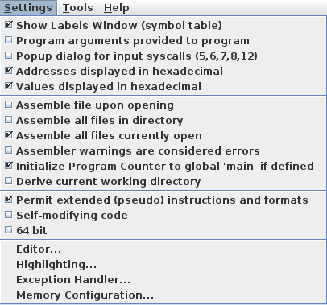

<!-- MASTER-ONLY: DO NOT MODIFY THIS FILE

Copyright © Telecom Paris
Copyright © Renaud Pacalet (renaud.pacalet@telecom-paris.fr)

This file must be used under the terms of the CeCILL. This source
file is licensed as described in the file COPYING, which you should
have received as part of this distribution. The terms are also
available at:
https://cecill.info/licences/Licence_CeCILL_V2.1-en.html
-->

Designing a minimal multi-task system

---

[TOC]

---

As for any lab do not forget to write a report in [Markdown syntax] in the `REPORT.md` file.
Remember that the written reports and source code are personal work (plagiarism is not accepted).
Do all assignments yourself and try to understand each of them.
You can of course discuss with others, exchange ideas, ask others for help, help others...
It is even warmly recommended, but at the end your report and source code must be your personal work.
They are due the day **before** the written exam at 23:59.
After this deadline the git repository will become read-only and there will be no possibility any more to add or modify something.

## Set-up

1. Open a terminal, change the working directory to the `ca` clone, check the current status.
   If the current branch is not your personal branch, switch to your personal branch and check again the current status.
   If your branch is not up to date with the remote or there is something to commit or the working tree is not clean, add, commit and/or pull until everything is in order.

1. Pull, merge with `origin/master`, change the working directory to this lab's directory and list the directory's content.
   `README.md` is the file you are currently looking at, `REPORT.md` is the empty file in which you will write your lab report, `os.s` is a starting point for our mini-OS, `taskA.s` and `taskB.s` are empty file in which you will code simple user tasks.

## Introduction

In the previous lab we discovered timers and timer interrupts and we used them to add a time-out mechanism to our toy application.
In this lab we will start designing a minimal Operating System (OS) for the RARS simulator.
Our mini-OS will be entirely coded in the exception handler, more precisely in the timer Interrupt Service Routine (timer ISR), and the startup code.
It will manage the sharing of the (simulated) RISC-V processor among several tasks, thanks to the (emulated) hardware timer.
The OS will program the timer to raise an interrupt every 100 ms.
Each time the timer interrupt is raised, the OS will suspend the currently running user task, select another suspended user task and let it resume.
        
In a first, simplified, version of our OS, we will assume that there are only two user tasks and that they are infinite loops that never terminate.
Moreover, we will assume that the user tasks:

* Do not access Control and Status Registers (CSR).
* Do not access the data of our mini-OS or of other user tasks.
* Use a stack of less than 1024 bytes (1 k-Byte).

In a real system these assumptions on user tasks would be enforced with the help of the hardware, thanks to a privileged mode / user mode separation but, as this separation is not implemented in RARS, will we optimistically consider that the user tasks are fair-play.

We do not make any other assumptions about the user tasks.
We pretend that we do not know which registers and other resources they use, when and how (even if this is not true because we will code them ourselves).
We pretend that we cannot predict when and in which state they will be interrupted (this is more realistic: it is difficult to predict exactly when the timer will raise its interrupt).

Advices:

- Because it is easy to make wrong decisions but difficult to debug kernel code with RARS, it is highly recommended to discuss with others and compare your understanding and decisions.
- If one of the RARS companion tools does not work as expected reset the simulator, disconnect all tools, reset all tools, reconnect the tools and run the program again.
- In order to print messages do not use memory-mapped IO, only system calls, it is much simpler.

## Launch RARS, settings, help

Launch RARS (just type `rars` in your terminal), open the `Settings` menu and configure it according the following picture:


## Assignments

### User tasks

1. Open the `taskA.s` file with your favorite editor and code a user task according the following specifications.
   Declare a label `taskA` as global and label the first instruction of the task `taskA`:

    ```
    .global taskA
    taskA:
    ```

   The task initializes a counter to 0, increments it until its value is `10007`, prints character '`A`' and restarts from the beginning.
   Of course you can declare functions and use them to code your task.
   The task itself is the top-level, complete, application.
   Do not code it as if it was a function; it is not called by a caller and it does not return to a caller.
   Instead it is launched by our mini-OS and never terminates (we do not have time to implement tasks termination in our mini-OS).
   Before launching the task the mini-OS will allocate a 1024 bytes stack and store its **highest** address in `sp` (remember that stasks grow towards low addresses).
   You can use this stack as you wish but remember that its size is limited to 1024 bytes.

1. Assemble `taskA.s` with RARS, simulate, debug if needed and verify that your task behaves as expected.

1. Code a second task in `taskB.s` which is exactly the same as `taskA`, except that it is labeled `taskB`, the maximum value of its counter is `30011` and the character it prints is '`B`'.
   The two tasks are completely independent and they can thus use the same registers.
   Their stacks (1024 bytes each) are different.
   Code each of them as if it was the only task in the system.

1. Assemble `taskB.s` with RARS, simulate, debug if needed and verify that your task behaves as expected.

### Understanding the starting point of the mini-OS

1. Open the `os.s` file with your favorite editor and study it carefully.
   It first declares a data segment and a text segment for the exception handler (label `exception_handler`), and then a data segment and a text segment for the startup code (label `main`).

1. In the data segment of the exception handler several text messages are declared; they correspond to the various exceptions that RARS supports.
   The array of 32 bits words labeled `_excp` gathers the base address of the messages for easier access.

1. All interrupts that RARS supports have an Interrupt Service Routine (ISR) declared (`_isr0`, ...).
   Currently the ISRs don't do anything, they just branch to the end of the exception handler (label `ret`).
   One of your assignments will be to add some code to the timer ISR (`_isr4`).
   The array of 32 bits words labeled `_isrs` gathers the address of the first instruction of the ISRs for easier management.

1. Finally a 1024 bytes _kernel stack_ (label `kstack`) is declared; it is the stack that our mini-OS will use for its private needs.

1. When an exception or an enabled interrupt occurs the currently running task is suspended and the exception handler starts executing.
   So, at the beginning of the text segment of the exception handler none of the general purpose registers can be used because any of them could store some useful data of the task that has just been interrupted when we enter the handler.
   Study the fist instructions of the exception handler and try to understand how the `uscratch` CSR is used to save `sp` such that it can be restored at the end.
   Observe also how the kernel stack is used to save some more registers such that the handler can use them and restore them at the end.
   Search the `ret` label, at the end of the exception handler and observe how these registers are restored from the kernel stack and the `uscratch` CSR.

1. When an exception or an enabled interrupt occurs the cause of the event is stored in the `ucause` CSR:

   - The Most Significant Bit (MSB) indicates if it is an interrupt (1) or an exception (0).
   - The 31 Least Significant Bits (LSBs) encode the exception or interrupt number.

   Study how the exception handler checks if it is an interrupt or an exception and how it branches to the `interrupts` label in case of an interrupt (more on this part later).

1. In case of an exception observe how the handler selects and prints the corresponding text message.

1. When an exception or an enabled interrupt occurs the address of the instruction that was executing (but that did not complete) is stored in the `uepc` CSR.
   The `uret` instruction used to return from the exception handler jumps at the address stored in the `uepc` CSR such that the interrupted application can resume.
   For interrupts it is usually what should be done: after dealing with the event we want to finish executing the instruction that has been interrupted.
   For exceptions things are a bit different and at least 3 cases must be considered:

   - There is no way to recover from the exception, the application must be terminated and an error message printed.
   - It is possible to recover from the exception, but the causing instruction must be skipped to avoid an infinite loop between the application and the handler.
   - It is possible to recover from the exception, but the causing instruction must be executed again in order to complete its operations.

   In our simple handler which of these 3 strategies is used for each type of exception?
   Do you understand how these 3 cases are implemented in the handler?

1. Analyze the code executed when the event is an interrupt.
   Do you understand how the handler selects the ISR to execute, gets the address of its first instruction and jumps to it?

1. The _startup code_ is the piece of code that runs first when we launch the simulation.
   Its data and text segments are near the end of the `os.s` source file.
   Study the text segment and try to understand it.

1. It first stores the address of the exception handler in the `utvec` CSR.
   This is needed as, when an exception or interrupt occurs, it is at the address stored in `utvec` that the hardware jumps.

1. Next it globally enables the exceptions and interrupts by setting a 1 in bit 0 of the `ustatus` CSR.
   When an exception or interrupt occurs it is ignored if this bit is not set to 1.
   In order to avoid collisions when exceptions or interrupts happen in rapid succession, this bit is automatically set to 0 by the hardware when an exception or interrupt occurs.
   Before being set to 0 it is copied to bit 4 of the `ustatus` CSR and it is automatically restored when the `uret` instruction is executed at the end of the handler.

1. Finally, in this first version, a text message is printed and the `Exit` system call is used to terminate the execution.

### Change the RARS settings

Open the `Settings` menu of RARS and configure it according the following picture:



Thanks to this small change RARS will assemble all files currently open in the editor, that is, `taskA.s` and `taskB.s`.
In the same `Settings` menu select `Exception Handler...`, check the option _Include this exception handler file in all assemble operations_, browse to the `os.s` file, and click `OK`.
From now on be very careful that `os.s` is never open in the editor when you assemble.
If it is, it will be assembled twice: one time as the declared exception handler and a second time as an open source file, causing errors about multiply-defined labels.
If you see such errors check that `os.s` is not open in the editor
Note: in case there are assembler errors in `os.s` RARS automatically opens it in the editor; do not forget to close it after you fixed the errors.

If they are not already, open `taskA.s` and `taskB.s` in the editor, assemble and simulate.
Is the behavior what you expected?

### Call a user task, test an exception

1. Create a fresh copy of [`os.s`](os.s):

    ```bash
    $ cp os.s os_1.s
    ```

1. Modify the startup code after the printing of the _Hello, World!_ message to call `taskA`.

1. In the RARS `Settings` menu select `Exception Handler...` and replace the `os.s` exception handler with `os_1.s`.

1. Assemble and simulate.
   Is the behavior what you expected?

1. Modify the code of `taskA.s` to cause an _instruction address misaligned_ exception: store the address of `taskA` in a general purpose register, and jump-and-link to the address in this register with a displacement of 2.
   As the resulting address is not a multiple of 4 any more, running this should cause an exception.

1. Assemble and simulate.
   Is the behavior what you expected?

1. Reset the simulator (`[Run -> Reset]`).
   Set a breakpoint to the faulty jump-and-link instruction you just added.
   Simulate; on the breakpoint note the content of `sp`, `pc`, the general purpose registers used by the handler, and the `ustatus`, `utvec`, `uepc`, `ucause` CSRs.
   Run step-by-step (`[Run -> Step]`) until we enter the exception handler.
   Observe the content of the `ustatus`, `utvec`, `uepc`, `ucause` CSRs.
   Can you explain their content?

1. Continue executing step-by-step (`[Run -> Step]`) in the exception handler.
   Try to understand all steps until the end of the handler.

1. Comment out the erroneous code you added in `taskA.s` (do not delete it).

Note: most of the other exceptions cannot be tested as we did for _instruction address misaligned_ because of the way RARS is designed: before they reach our exception handler the simulator catches them, prints its own error message and stops the simulation.

### Add a timer ISR

**Important**: remember, when modifying the exception handler, that we cannot use any general purpose register, without precaution.
The interrupted user tasks can use **any** of them when they are interrupted.
Chose carefully.
If you want to use more general purpose registers than the ones that are saved in the kernel stack at the beginning, save them too and restore them at the end of the handler.

1. Create a fresh copy of `os_1.s`:

    ```bash
    $ cp os_1.s os_2.s
    ```

1. Open the `os_2.s` file with your favorite editor and modify the timer ISR to:

   - Print character '`*`'.
   - Read the current value of the `time` counter of the `Timer Tool` in a general purpose register.
   - Add 100 to it (for 100 milliseconds).
   - Store it to the `timecmp` address of the `Timer Tool`.
   - Branch to the `ret` label (this is already coded).

1. In the same `os_2.s` file modify the startup code just before the part that enables the interrupts globally:

   - Read the current value of the `time` counter of the `Timer Tool` in a general purpose register.
   - Add 100 to it (for 100 milliseconds).
   - Store it to the `timecmp` address of the `Timer Tool`.

1. In the same `os_2.s` file modify the startup code just after the part that enables the interrupts globally and enable the interrupt of the `Timer Tool` in the `uie` CSR.
   Indeed it is not enough to configure the timer and to enable the interrupts globally; if the timer interrupt is not specifically enabled in `uie`, it is ignored.

1. In the RARS `Settings` menu select `Exception Handler...` and replace the `os_1.s` exception handler with `os_2.s`.

1. Assemble, launch the `Timer Tool`, connect it to the running program, start the timer, and simulate.
   Is the behavior what you expected?

1. Modify again the startup code in `os_2.s` to call task `taskB`, instead of `taskA`.

1. Assemble, launch the `Timer Tool`, connect it to the running program, start the timer, and simulate.
   Is the behavior what you expected?

### Context switch

We will now modify our mini-OS to switch between `taskA` and `taskB` every 100 milliseconds.
It is the timer ISR that will do most of the job but we will also need to enhance our startup code such that it initializes the _task contexts_ before launching `taskA` and letting the timer ISR do the rest.

In order to resume a suspended user task, the OS must restore the execution context of the task in exactly the same state as when the user task was preempted.
So, this context must have been saved when the task was last suspended.
All in all, when the timer interrupt is raised, the timer ISR of our mini-OS must:

- Gather the context of the currently running user task, store it somewhere.
- Restore the context of the other user task.
- Re-program the timer.
- Resume the other user task.

1. First list the registers (and other information, if any) that constitute the context of a running task.

1. For each of them identify where the timer ISR can find it (the _from_) and where it shall store it (the _to_).

1. Imagine the data structure that the OS will use to navigate among the tasks, their saved contexts and to decide which task must be resumed.
   Decide where this data structure will be stored.

1. Create a fresh copy of `os_2.s`:

    ```bash
    $ cp os_2.s os_3.s
    ```

1. Edit `os_3.s`:

   - If needed update the data segment of the exception handler to add the declarations for the data that your mini-OS will use.
   - Adapt the startup code to initialize the data that your mini-OS will use.
   - Add the context switching code to the timer ISR.

1. In the RARS `Settings` menu select `Exception Handler...` and replace the `os_2.s` exception handler with `os_3.s`.

1. Assemble, launch the `Timer Tool`, connect it to the running program, start the timer, and simulate.
   Is the behavior what you expected?

### Relaxing the constraints

You don't have to code anything to answer the following questions, but feel free to do so if you wish.
If you decide to code, please do not modify `taskA.s`, `taskB.s` and `os_3.s`; create new files.

Consider the limitations we initially introduced to simplify the first version of our mini-OS: there are only two user tasks, they are infinite loops that never terminate.

1. How would you modify your mini-OS to run, e.g., 8 tasks instead of 2?

1. Suppose the user tasks are not infinite loops and they terminate after a while.
   Suppose also that we want to terminate the RARS simulation when all tasks terminated.
   How would you modify your mini-OS to let a user task signal that it terminates and to schedule only non-terminated tasks for execution.

1. Suppose we would like to let the person who runs the simulation decide which task to start, which task to terminate, using the _Keyboard and Display MMIO Simulator_ companion tool to display a menu and get user choices.
   How would you do?

## Report, add, commit, push

Write your report, add `REPORT.md`, `taskA.s`, `taskB.s`, `os_1.s`, `os_2.s` and `os_3.s`.
If you created new source files to answer the last part, please add them too.
Commit and push in your personal branch.

<!-- vim: set tabstop=4 softtabstop=4 shiftwidth=4 expandtab textwidth=0: -->
